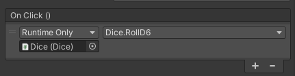
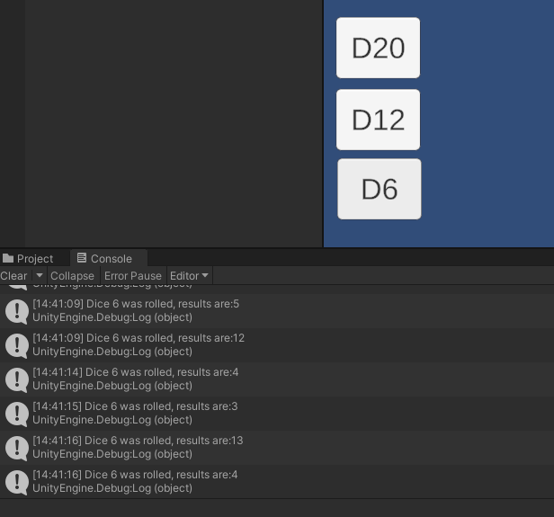

# TEXT BASED RPG

Fundamentals in Games Development

Joshua Bellas

2326296

## FUNDAMENTAL FUNCTIONS

Using the [Unity Scripting API](https://docs.unity3d.com/ScriptReference/Random.Range.html) I first researched into the basic process of generating and storing values in the log itself. The code displays how the scrpit for 'Dice' rolls all three die upon the start of the process, calling each function repspectively that generates a random number in a set range.

```csharp
public class Dice : MonoBehaviour
{
    public void Start()
    {
        RollD6();
        RollD12();
        RollD20();
    }
    public void RollD6()
    { 
        int diceRollResult = Random.Range(1,7);
        Debug.Log("Dice 6 was rolled, results are:" + diceRollResult);
    }
    public void RollD12()
    {
        int diceRollResult = Random.Range(1, 13);
        Debug.Log("Dice 6 was rolled, results are:" + diceRollResult);
    }

    public void RollD20()
    {
        int diceRollResult = Random.Range(1, 21);
        Debug.Log("Dice 6 was rolled, results are:" + diceRollResult);
    }


}
```
Following this I then, within the Unity editor, create three button objects, each providing them with an OnClick function that allows the Roll function to be manually carried out upon clicking these buttons.


Figure 1. Unity Button OnClick() Event

Looking at the debug log it shows that only the six sided dice was being rolled despite rolling numbers higher than it.


Figure 2. Unity Debug log on first test.

I fixed this by altering the debug log to display properly which dice was being rolled according to the appropriate function. 

```csharp
public void RollD6()
{ 
    int diceRollResult = Random.Range(1,7);
    Debug.Log("Dice 6 was rolled, results are:" + diceRollResult);
}
public void RollD12()
{
    int diceRollResult = Random.Range(1, 13);
    Debug.Log("Dice 12 was rolled, results are:" + diceRollResult);
}

public void RollD20()
{
    int diceRollResult = Random.Range(1, 21);
    Debug.Log("Dice 20 was rolled, results are:" + diceRollResult);
}
```
Evidenced by this it was clear that it was fixed:


Figure 3. Debug log showing the change is in affect.

## FURTHER FUNCTIONALITY

Given that the die already being used were three die commonly used in the Dungeons and Dragons game, I decided to implement a few more die in order to create a rolling system similar to one found within Dungeons and Dragons.

Looking into the [Rules of dice in Dungeons and Dragons](https://www.dieharddice.com/pages/dnd-dice-explained#:~:text=There%20are%20actually%20two%20ten,double%20zero%20roll%20is%20100.), I then decided that I would implement the D4, D8 and D10 die from the game using the same process I had before, but amending a few of the functions.

I started with adding the three new die, each of which having their own debug logs and adjusted ranges. Alongside this I added a new check under the function 'CritCheck' which allowed to see if a roll from the D20 was a 20, as in Dungeons and Dragons, a 20 is registered as a critical hit, thus wanting to recreate it in this environment.

```csharp
     public void RollD20()
     {
        int diceRollResult = Random.Range(1, 21);
        CritCheck(diceRollResult);
        Debug.Log("Dice 20 was rolled, results are:" + diceRollResult);
    }
    public void RollD8()
    {
        int diceRollResult = Random.Range(1, 9);
        Debug.Log("Dice 8 was rolled, results are:" + diceRollResult);
    }
    public void RollD4()
    {
        int diceRollResult = Random.Range(1, 5);
        Debug.Log("Dice 4 was rolled, results are:" + diceRollResult);
    }

    public void RollD10()
    {
        int diceRollResult = Random.Range(1, 11);
        Debug.Log("Dice 10 was rolled, results are:" + diceRollResult);
    }

    public bool CritCheck(int value)
    {
        if (value == 20)
        {
            Debug.Log("Critical Hit! You rolled a 20.");
            return true;
        }
        return false;
    }

}
```

## IMPLEMENTING MORE MECHANICS

### Card System:
```markdown
To add a bit more depth to the combat and give it more of a gameplay loop and that endless killer style gameplay, I wanted to intergrate a card system that determines your attacks, with the start of each turn dealing the player 3 cards that they can use to attack the opposite enemies.

This process will then continue to repeat until the player dies and or reaches a high score based on their wave round.
```

```csharp
namespace CardsList
{

    public class Cards : MonoBehaviour
    {
        public int skillPointsRequired;
        public int skillPointsCheck;
        public ClassData player;
        public Enemy enemy;

        public bool checkSkillPoints()
        {
            if (player.skillPoints >= skillPointsRequired)
            {
                return true;
            }
            else return false;

        }
        public bool BasicAttackCard()
        {
            skillPointsRequired = 1;
            if (checkSkillPoints())
            {
                player.skillPoints = player.skillPoints - 1;
                Debug.Log("Successful Basic Attack");
                return true;
            }
            else Debug.Log("Invalid Input"); return false;
        }

        public bool HeavyAttackCard()
        {
            skillPointsRequired = 2;
            if (checkSkillPoints())
            {
                player.skillPoints = player.skillPoints - 2;
                Debug.Log("Successful Heavy Attack");
                return true;
            }
            else Debug.Log("Invalid Input"); return false;
        }

        public bool DefendCard()
        {
            skillPointsRequired = 0;
            if (checkSkillPoints())
            {
                Debug.Log("Successful Defend");
                return true;
            }
            else Debug.Log("Invalid Input"); return false;
        }

        public void BasicAttack()
        {
            BasicAttackCard();
            Debug.Log(player.playerName);
            if (enemy != null)
            {
                Debug.Log(enemy.EnemyName);
                enemy.takeDamage(enemy.EnemyDefence);
            }
            else
            {
                Debug.Log("Enemy is null!");
                enemy = GameObject.Find("Enemy").GetComponent<Enemy>();
                enemy.takeDamage(enemy.EnemyDefence);
            }
        }

        public void HeavyAttack()
        {
            HeavyAttackCard();
            player.doDamage(player.attack);
        }

        public void Defend()
        {
            DefendCard();
        }
    }
```
*Figure 4. Program code for the various different attacks and their associated skill costs*

```markdown
Through implementing the card system, I effecitvely add a more in depth strategy system to the basic gameplay loop that allows for more replayability whilst adding some challenge and allowing the game to feel effective at capturing the core idea. 
```

### Turn System

```markdown
For a last feature to implement to get the game working I add on a turn system that allows the player's cards to be given to them at the beginning of the turn whilst also allocating them a singular skill point
```

```csharp

```
*Figure 5. Program code for the turn system and its functionality and the way in which it works.*

### Card Allocation
```csharp

```
*Figure 6. Program code for the card allocation system*

### Enemy Spawner
```csharp

```
*Figure 7. program code for the enemy respawner*

## Outcome

```markdown
Here are a variety of links that lead to the game's gameplay being demonstrated, alongside a link to view the github repository online and download the current build of the game for yourself through Itch.io
```

- [Gameplay in action](https://www.youtube.com/watch?v=dQw4w9WgXcQ&ab_channel=RickAstley)
- [Github repository link](https://github.com/githubtraining/hellogitworld)
- [Game demo on Itch.io](https://samperson.itch.io/desktop-goose)

## Critical Reflection

### What did or did not work well?

```markdown
Upon completion I feel that the endless style nature of the game and the turn based system allows for a lot of replayability as it creates an almost arcaic style of gameplay that allows the user to keep playing.

I feel that the execution of the skill point system then adds a lot to the game and provides good strategy however could be expanded upon to allow for more flexibility and planning as opposed to the system being very linear and only adding one skill point per turn, possibly adding a skill point for each enemy defeated to allow for a bit more of a risk reward system with the way you spend your skill points.
```