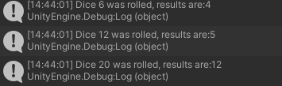

# TEXT BASED RPG

Fundamentals in Games Development

Joshua Bellas

2326296

## FUNDAMENTAL FUNCTIONS

Using the [Unity Scripting API](https://docs.unity3d.com/ScriptReference/Random.Range.html) I first researched into the basic process of generating and storing values in the log itself. The code displays how the scrpit for 'Dice' rolls all three die upon the start of the process, calling each function repspectively that generates a random number in a set range.

```csharp
public class Dice : MonoBehaviour
{
    public void Start()
    {
        RollD6();
        RollD12();
        RollD20();
    }
    public void RollD6()
    { 
        int diceRollResult = Random.Range(1,7);
        Debug.Log("Dice 6 was rolled, results are:" + diceRollResult);
    }
    public void RollD12()
    {
        int diceRollResult = Random.Range(1, 13);
        Debug.Log("Dice 6 was rolled, results are:" + diceRollResult);
    }

    public void RollD20()
    {
        int diceRollResult = Random.Range(1, 21);
        Debug.Log("Dice 6 was rolled, results are:" + diceRollResult);
    }


}
```
Following this I then, within the Unity editor, create three button objects, each providing them with an OnClick function that allows the Roll function to be manually carried out upon clicking these buttons.


Figure 1. Unity Button OnClick() Event

Looking at the debug log it shows that only the six sided dice was being rolled despite rolling numbers higher than it.


Figure 2. Unity Debug log on first test.

I fixed this by altering the debug log to display properly which dice was being rolled according to the appropriate function. 

```csharp
public void RollD6()
{ 
    int diceRollResult = Random.Range(1,7);
    Debug.Log("Dice 6 was rolled, results are:" + diceRollResult);
}
public void RollD12()
{
    int diceRollResult = Random.Range(1, 13);
    Debug.Log("Dice 12 was rolled, results are:" + diceRollResult);
}

public void RollD20()
{
    int diceRollResult = Random.Range(1, 21);
    Debug.Log("Dice 20 was rolled, results are:" + diceRollResult);
}
```
Evidenced by this it was clear that it was fixed:


Figure 3. Debug log showing the change is in affect.

## FURTHER FUNCTIONALITY

Given that the die already being used were three die commonly used in the Dungeons and Dragons game, I decided to implement a few more die in order to create a rolling system similar to one found within Dungeons and Dragons.

Looking into the [Rules of dice in Dungeons and Dragons](https://www.dieharddice.com/pages/dnd-dice-explained#:~:text=There%20are%20actually%20two%20ten,double%20zero%20roll%20is%20100.), I then decided that I would implement the D4, D8 and D10 die from the game using the same process I had before, but amending a few of the functions.

I started with adding the three new die, each of which having their own debug logs and adjusted ranges. Alongside this I added a new check under the function 'CritCheck' which allowed to see if a roll from the D20 was a 20, as in Dungeons and Dragons, a 20 is registered as a critical hit, thus wanting to recreate it in this environment.

```csharp
     public void RollD20()
     {
        int diceRollResult = Random.Range(1, 21);
        CritCheck(diceRollResult);
        Debug.Log("Dice 20 was rolled, results are:" + diceRollResult);
    }
    public void RollD8()
    {
        int diceRollResult = Random.Range(1, 9);
        Debug.Log("Dice 8 was rolled, results are:" + diceRollResult);
    }
    public void RollD4()
    {
        int diceRollResult = Random.Range(1, 5);
        Debug.Log("Dice 4 was rolled, results are:" + diceRollResult);
    }

    public void RollD10()
    {
        int diceRollResult = Random.Range(1, 11);
        Debug.Log("Dice 10 was rolled, results are:" + diceRollResult);
    }

    public bool CritCheck(int value)
    {
        if (value == 20)
        {
            Debug.Log("Critical Hit! You rolled a 20.");
            return true;
        }
        return false;
    }

}
```

## IMPLEMENTING CLASSES
A core part of Dungeons and Dragons gameplay is the various [classes](https://www.dndbeyond.com/sources/dnd/basic-rules-2014/classes) you can choose from that each have their own unique aspects to them. One of the bigger aspects relating to functionality is that fact that different classes have access to different die, so as an extension of these die I create a class system that is decided from the start of the game, which then checks for the die that are avaliable to each specific class.

The four classes I selected to implement as part of the program was the Barbarian, Druid, Ranger and Paladin. The Barbarian uses a D12, the Druid uses a D8, the Ranger uses D10 and the Paladin uses D10. 
